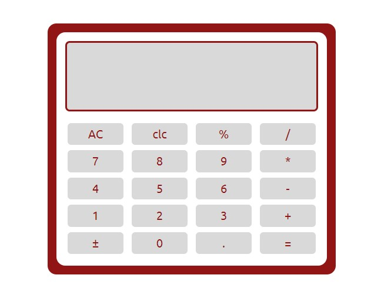
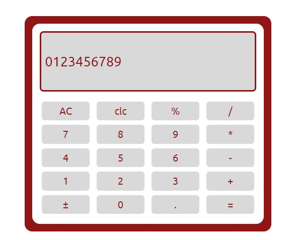

## Calculator App

The Calculator App is a simple web-based calculator application built using HTML, CSS, and JavaScript. It provides basic arithmetic operations such as addition, subtraction, multiplication, and division, as well as the ability to calculate percentages.

## Features

- Addition, subtraction, multiplication, and division of numbers.
- Calculation of percentages.
- Responsive design, ensuring a consistent user experience across different devices.

## How to Use

1. Clone the repository to your local machine.
2. Open the `index.html` file in your web browser.
3. The calculator app will be displayed on the screen.
4. Use the number buttons to input numbers.
5. Use the operation buttons (+, -, *, /) to perform arithmetic operations.
6. Use the "%" button to calculate percentages.
7. Click the "=" button to display the result of the calculation.
8. Click the "clc" - "Clear Entry" button to remove the last input.
9. Click the "AC" - "Clear All" button to reset the calculator.

## Technologies Used

- HTML
- CSS
- JavaScript

## Demo

You can try out the live demo of the Calculator App [here](https://classy-truffle-409936.netlify.app/).

## Screenshots

## Contributing

Contributions to the Calculator App are welcome! If you find a bug or want to add new features, feel free to open an issue or submit a pull request.

## Contact

If you have any questions or suggestions regarding the Calculator App, please feel free to contact us at [email@example.com](odujirinoluwadamilolasandra@gmail.com).

---

We hope the Calculator App helps you with your daily calculations!
